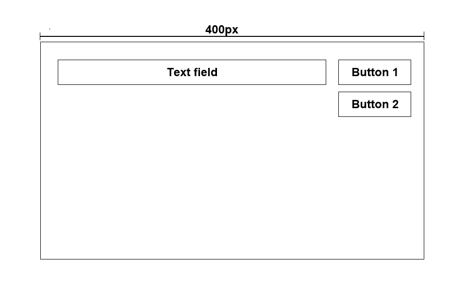

# Getting Started with Task 1

This project was bootstrapped with [Create React App](https://github.com/facebook/create-react-app).

## How to run the project

In the project directory, you can run:

```
npm install
npm start
```

### `npm start`

Runs the app in the development mode.\
Open [http://localhost:3000](http://localhost:3000) to view it in your browser.

The page will reload when you make changes.\
You may also see any lint errors in the console.

## Task 1: Coding assignment 1

You can accomplish this task using any JavaScript framework you like, or even with pure JavaScript.



-   Outer frame: Width 400px, no height limit, with border "1px solid red".
-   Inner element: 2 buttons, 1 text field, you can arrange them as you like.
-   Text field: Non-editable as normal, just like `<p></p>` or any block element, and can be edited after clicking button 1.
-   Button 1: With the text "edit", when the user clicks it, text field will toggle between non-editable and editable modes.
-   Button 2: With the text "resize", when the user clicks it, outer frame will toggle between 400px and 800px.

Expect: The buttons' size should be fixed, and the text field should automatically resize when the outer frame or inner text changes.