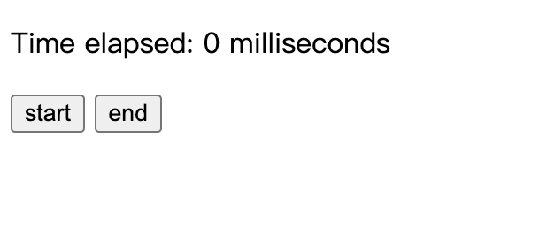

# Getting Started with Task 2
Open index.html in browser

- start button to start the timer
- end button to end the timer
- result to show the time elapsed (in milliseconds)
- message to show the error message

